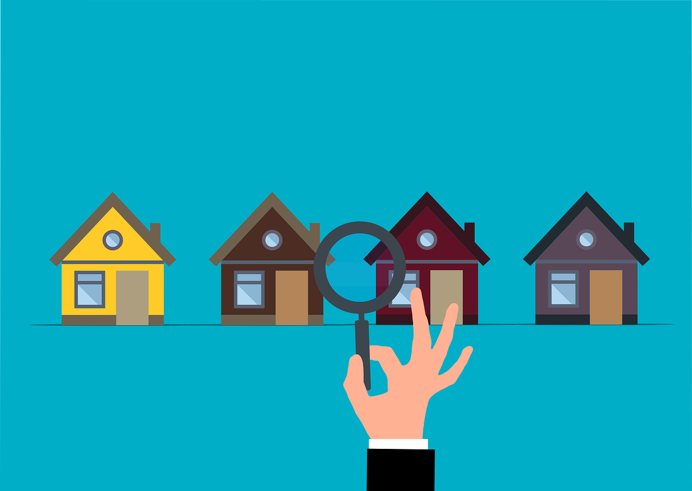

# king_county_house_sales

This is an Insight Project for my portfolio. The main idea is to gather information from data in order to find valuable insights to guide fictitious stakeholders, from a real estate company, in their decision making. The business of this fictitious company is to buy houses for a low price and sell these houses for a higher price. The insights found in this project will promote more accurate choices by the stakeholders, in order to thrive the company business.

# 1.0 - Business Problem

After some years of operation, the real state company decided to expand its business to a new operation area: King County - Washington. A kickoff meeting took place with the business team, data team, stakeholders and others. In this meeting one of the most relevant subject was the aspects of buying and selling houses in this new location. After a long debate, some questions were highlighted and the data team must answer these questions until the next meeting. The questions and hypothesis are listed in section 3 of my <a href="https://github.com/rodrigomm92/king_county_house_sales/blob/main/insight_project_kc_houses.ipynb">Jupyter Notebook</a>.

After the ending of the meeting, the CEO itself asked the data team to build a dashboard with useful information to follow the real state market in that area. This dashboard must be accessible from any place and any device. The CEO also required recommendations of houses to buy and to sell. The delivered dashboard can be accessed through this <a href="https://meu-dash-streamlit-kc-house.herokuapp.com/">Streamlit Dashboard</a>.

The data we are going to use is a public dataset that can be found in this <a href="https://www.kaggle.com/datasets/harlfoxem/housesalesprediction">Kaggle Dataset</a>.

| Attribute | Description |
| :----- | :----- |
| id | Unique ID for each home sold |
| date | Date of the home sale |
| price | Price of each home sold |
| bedrooms | Number of bedrooms |
| bathrooms | Number of bathrooms, where .5 accounts for a room with a toilet but no shower |
| sqft_living | Square footage of the home interior living space |
| sqft_lot | Square footage of the land space |
| floors | Number of floors |
| waterfront | A dummy variable for whether the home was overlooking the waterfront or not |
| view | An index from 0 to 4 of how good the view of the property was |
| condition | An index from 1 to 5 on the condition of the home |
| grade | An index from 1 to 13, where 1-3 falls short of building construction and design, 7 has an average level of construction and design, and 11-13 have a high quality level of construction and design |
| sqft_above | The square footage of the interior housing space that is above ground level |
| sqft_basement | The square footage of the interior housing space that is below ground level |
| yr_built | The year the home was initially built |
| yr_renovated | The year of the home’s last renovation |
| zipcode | What zip code area the home is in |
| lat | Latitude |
| long | Longitude |
| sqft_living15 | Average size of interior housing living space for the closest 15 houses, in square feet |
| sqft_lot15 | Average size of land lots for the closest 15 houses, in square feet |

# 2.0 - Business Assumptions

We need to stablish some premises before we move on into the analysis:

- The company business are only buying and selling houses, not renting;
- All houses from the dataset are available for buying and selling;
- The zero values in feature 'yr_renovated' means that a house wasn't renovated yet;
- Some houses were sold more than once. All these values were considered.

# 3.0 - Solution Strategy

The development of the solution followed the CRISP-DM/DS methodology, with some minor changes (since we are not building a ML model in this project):

1. **Business problem:** Acknowledge the stakeholders needs and thoughts;

2. **Business understanding:** How the business works, what are the KPIs, its metrics and key characteristics of the real state business;

3. **Data extraction:** Collect data from Kaggle and import it using a jupyter notebook.

4. **Data cleaning:** Use python and its libraries to check for outliers, NA detection/treatment, feature engineering;

5. **Exploratory data analysis:** Use the cleaned dataset to draw charts with matplotlib and seaborn in order to discover insights, answer questions, evaluate hypothesis, uncover hidden information from the data;

6. **Dashboard deployment:** Use Streamlit to create a dashboard with relevant information about the business and the information gathered from the dataset. Deploy it on Heroku platform.

# 4.0 - Top Data Insights

- Interior living space is more important then total space of the property.
- Bathrooms have a higher aggregated value then bedrooms.
- There is a business opportunity of buying houses on winter and sell them on spring or summer for a higher average price.
- Statistically, houses with condition 1 and 2 have the same value. At the same time that from condition 2 to 3 the price rises more than 50%.
- Waterfront houses are more then 200% more expensive then those who are not waterfront
- Renovated houses are 43% more expensive than not renovated ones.
- The relation between grade and price is practically exponential.

# 5.0 - Business Outcomes

- When buying a house, consider the interior living space instead of the total space of the property;
- In order to make the selling more profitable, consider the possibility and the costs to build extra bathrooms;
- Prioritize buying houses on winter and selling on summer/spring. This will increase the profit.
- Since the price of houses with condition 1 and 2 are statistically the same, the best strategy is to buy houses with condition 2 and evaluate the costs to upgrade it to condition 3 in order to capitalize the increase in the house price;
- Evaluate the costs to renovate a house. We have an average margin of 43% to spend in the renovation. If the costs is less then this value, is worth to renovate it and make more profit when selling the house;
- Since the relation between grade and price is almost exponential, it is a good call to invest resources to upgrade the grade to its highest level, in order to sell the house for higher prices, increasing the overall profit.
- The best strategy is to buy houses at the beginning of the winter (when the average prices are lower) and invest resources to enhance some house aspects (items listed above) in order to sell it on summer/spring. Doing so, it will achieve the **maximum profit**.

After following the steps above, I created a list (<a href="https://github.com/rodrigomm92/king_county_house_sales/blob/main/recommendations.csv">recommendations.csv</a>) with 168 houses that could be bought and sold afterwards. This is the expected result:

|        |                          USD                        |
| :-------------: | :----------------------------------------------------------: |
|     **Initial investment**    |       55,087,889        |
|     **Income**    |       83,282,847        |
|     **Partial profit**      |                    28,194,958*                    |

*To get the final profit we have to account the money spent to renovate these houses.

# 6.0 - Conclusions

After the kickoff meeting a lot of work was done in order to get valuable information for the business team and stakeholders. Important insights were highlighted, a dashboard was created and a initial list of recommended houses was built. These deliverables will be used in the next sprint, where the teams will decide whether to go deeper into a more refined solution, or use all this intel to make decisions about the business and move on to other projects.

# 7.0 - Next steps

- Gather more information about house sales in other years, in order to get more time based insights, like tendency and seasonality.
- Gather information about the costs of a house reform, to enhance the house view, construction of bathrooms, house renovation, construction of basement. With this info we can define more strategies to achieve better financial results for the company.
- Gather information about criminality; distance to groceries stores, markets, drugstores and schools.
- Use some of the data gathered in the above items to add some metrics to the dashboard (ROI, ROE, NOI, Cap Rate)
- Investigate multicollinearity between the independent variables.
- Build a model to predict, based on the available information, the price of any house.

# 8.0 - Used Tools

